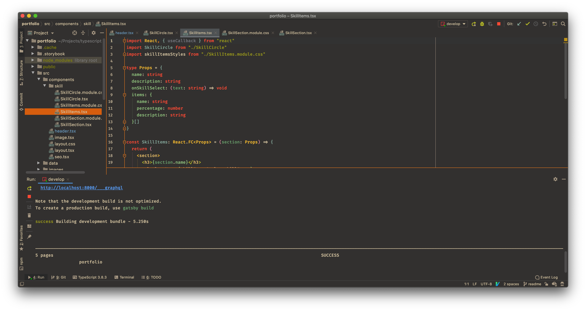
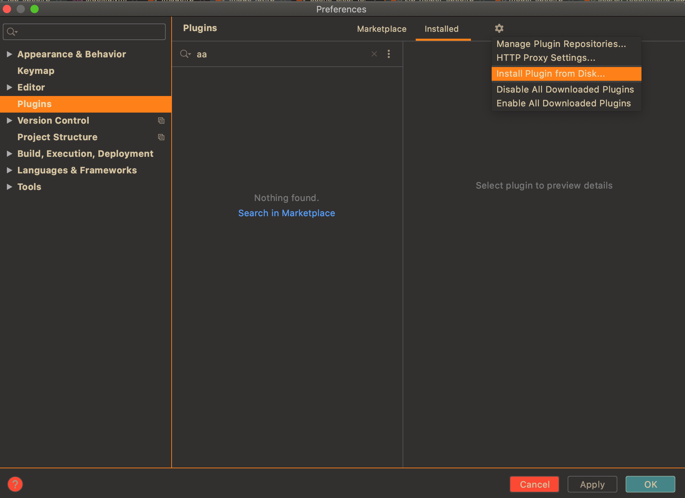
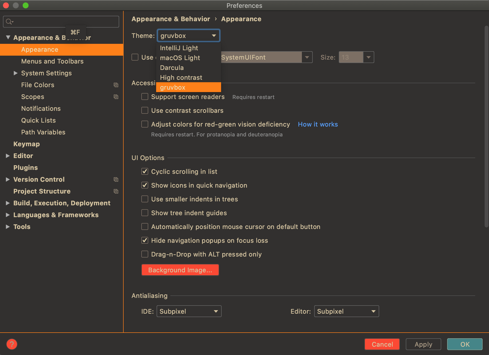

# gruvbox-theme

[gruvbox](https://github.com/morhetz/gruvbox) Theme for JetBrains IDEs.

## Install
1. Please download from [release page](https://github.com/k-ymmt/gruvbox-theme/releases).
2. JetBrains IDEs(e.g. Intelli IDEA) Preferences > Plugins > ⚙ > Install plugin from Disk...

3. Select downloaded file(.jar)

## Usage
1. Preferences > Appearance & Behavior > Appearances
2. Select Theme to *gruvbox*

